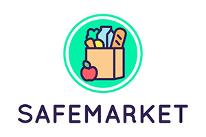
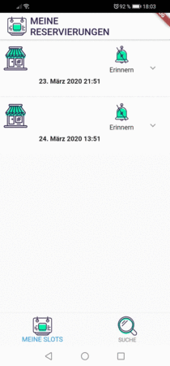

# SafeMarket

## Project
Our project was created during the [#WirVsVirus hackathon](https://wirvsvirushackathon.devpost.com).

SafeMarket is a digital reservation service which minimizes infections and queues. It allows people visiting a place to see the future, planned occupancy rate. Our first use case during the Corona pandemic is the visit of a store such as a supermarket with minimizing social interactions.

The retailer creates with the [SafeMarket backoffice version](https://github.com/SafeMarket-WirVsVirus/frontend-backoffice) an entry for the store and defines:
  - opening hours
  - slot length for a reservation
  - maximal capacity of people for a slot which can be booked via the system (this also allows the retailer to have a mixed group of SafeMarket and non-SafeMarket customers)

The customer uses the SafeMarket app to search for registered stores and to make reservations for these shops.
Furthermore, the app displays the QR code of a reservation which can be verified by the retailer.

For more details please check our [project description on devpost](https://devpost.com/software/17_supermarkt_status_reservation_system).

## SafeMarket App

This repository contains the app which is used by the customer to make a reservation.

Please check the [ReadMe](reservation_system_customer/README.md) for the feature set as well as code documentation.

### Features
- Display, create and cancel reservations
- Reminders for reservations
- Search for registered locations and filter results by overall occupancy rate per day
- Display occupancy rate per slot of locations

### Architecture

#### Backend and Data Layer

- [Swagger](https://wirvsvirusretail.azurewebsites.net/swagger/ui/index.html) definition of our backend
- `repository`: backend communication as well as persistence
- `repository/data`: model classes

#### UI Layer
- `bloc`: state management
- `ui/reservations`: UI elements for reservations tab
- `ui/map`: UI elements for the map tab

