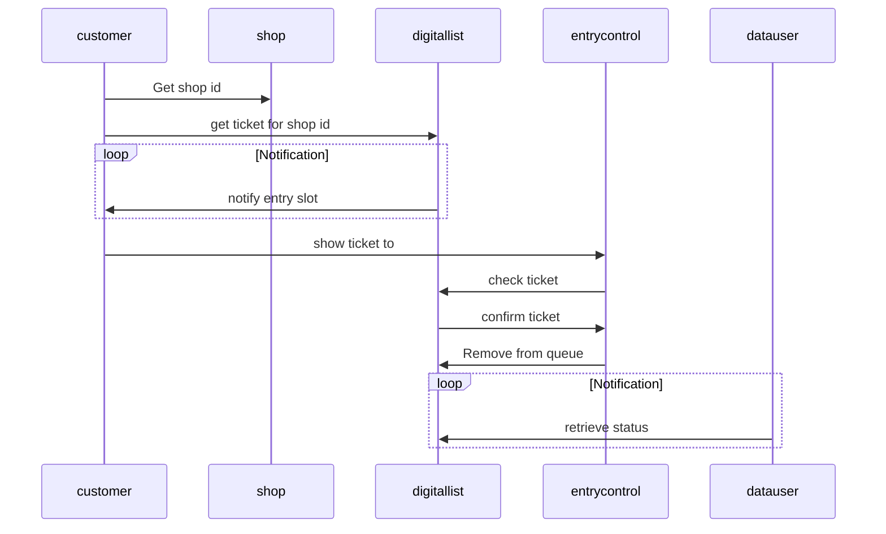

# Reservation System

Reservation system for WirVsVirusHackathon

## Sequence diagram

## Basic Architecture

### Components required:

#### Customer Frontend
The customer frontend is used to generate new tickets for the location, it will also show an overview of the current waiting time for new tickets. Can be used just like the "offline" ticket machines, we know from Finanzamt. As soon as a ticket is acquired it will show the estimated waiting time for the corresponding ticket. 

#### Entry Conrol Frontend
The entry control frontend is used to check tickets and also create local tickets for customers w/o smart devices

#### Ticket Database
Database holds the all the tickets for all shops and is also used as an archive to request data

#### Objects: 

- Shop
  - GPS Location, Address
  - "Ticketlist"
  - open_from
  - open_until

- Ticket
  - label
  - Userid
  - start_timestamp
  - end_timestamp
  - status
  
 
- User
  - GPS Location
  - traveling speed settings
  - 

#### 

